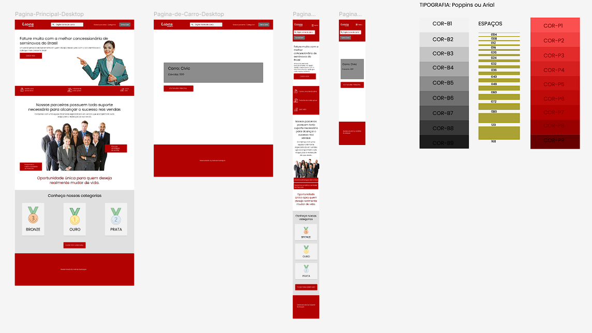

O que baixar para rodar o projeto localmente ?

- Vs code
- Node.js
- Git

1 etapa:
Crie uma pasta vazia no seu computador com o nome que desejar, em seguida abra essa pasta no vs code e abra o terminal integrado usando o bash. Copie o comando a seguir (copie também o .): git clone https://github.com/gabriel-eustaquio/lions.git .

2 etapa:
certifique que no bash está dentro da pasta do projeto. Digite: npm install e em seguida npm run dev

3 etapa
será disponibilizado um link para visualizar o projeto provavelmente em http://lcoalhost:3000

LEIA:
Caso não queira rodar localmente, poderá acessar o link: https://lions-brown.vercel.app/

# Quais tecnologias utilizei ?

React com Typescript + Next.js

Antes do desenvolvimento do site, fiz um protótipo no figma. (UI Design) Confira em: https://www.figma.com/design/0VmaLEBMw5OKVJU0geGASo/Untitled?node-id=0-1&t=HaEJp9ThPRTCf9kN-1

## Decidi utilizar as tecnologias acima pois fiz uso de rotas dinâmicas para o campo de busca (search bar). Código está separado em componentes para fácil reutilização de código e manutenção.

## Simulei uma api para retornar dados ao meu frontend e utilizar no search bar.

# O site funciona tanto no computador quanto no celular (Responsivo).

Implementei animação (apenas na parte principal/main) e inclui também tema dark.

